# Testnet

Create a cryptocurrency testnet with multiple nodes to transfer test funds between nodes using puppeth, geth and MyCrypto wallet

## Tools

- [git bash](https://git-scm.com/downloads)

- [geth](https://geth.ethereum.org/downloads/)
  - *download the latest version of `Geth & Tools` for your system*

- [puppeth](https://geth.ethereum.org/downloads/)
  - *included with `Geth & Tools`*

- [MyCrypto Wallet](https://download.mycrypto.com/)

### Setup

- Create a directory for your testnet

- Unpack the folder within `Geth & Tools`

  - Move folder to your testnet directory
  
  - Rename folder to something simpler, like **Blockchain-Tools**

- Install **MyCrypto Wallet**

  - Create a new wallet using a **Mnemonic Key**

    - *RECORD YOUR KEY IN A SAFE PLACE*

### Create blockchain

- Open `git bash` and navigate to your testnet directory

- Create a folder with your directory *inside* the `Blockchain-Tools` folder

  - Name this folder `testnet`

- Navigate into `testnet` and run the following

  ``` bash
  ../geth --datadir node1 account new
  ```

- Choose *(and write down or otherwise save)* a password and *save the public address that `geth` returns*


  ``` bash
  ../geth --datadir node2 account new
  ```

- Choose another password and *be certain to save your node's password* save the public address `geth` returns

- Run `puppeth` and follow the propmpts

  ``` bash
  ../puppeth
  ```


- Name your network `testnet` *or whatever you would like*

- Select 2:

  ``` bash
  2. Configure new genesis
  ```

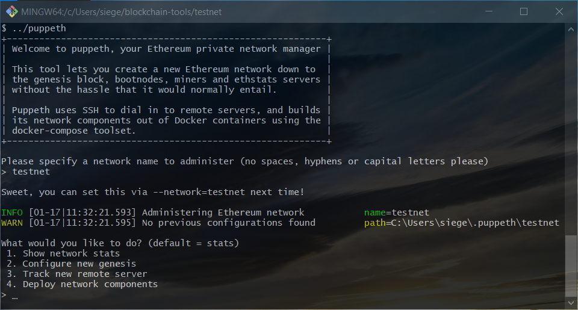

- Create a new genesis

- Use the `Clique - proof-of-authority` engine

- Paste both of the addresses from earlier to both *seal* and *pre-fund*

  - *PoA (proof-of-authority algorithms offer no mining rewards, so pre-funding is necessary*)

- Funding precompile addresses is optional

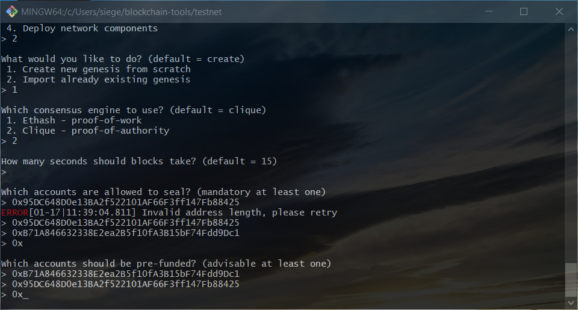

- When `puppeth` returns to the main menu, select:

  ``` bash
  2. Manage existing genesis
  ```

- Then export genesis configuration

  ``` bash
  2. Export genesis configuration
  ```

- This may throw an error or two as it fails to generate two files, but you only need one of the files it **will** produce

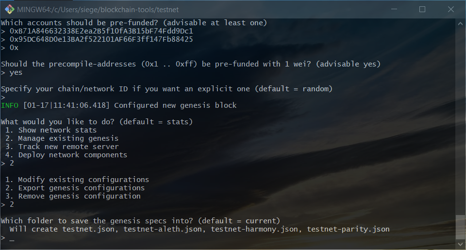

### Initialize the Nodes

- Run `geth` once more for each node, using the newly created `testnet.json` produced in the previous step

  ``` bash
  ../geth --datadir node1 init testnet.json
  ```

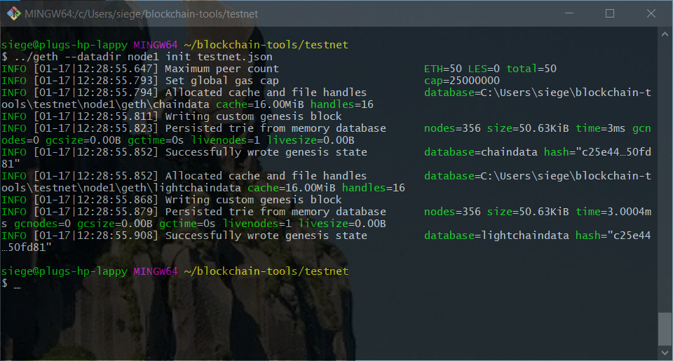

  ``` bash
  ../geth --datadir node2 init testnet.json
  ```

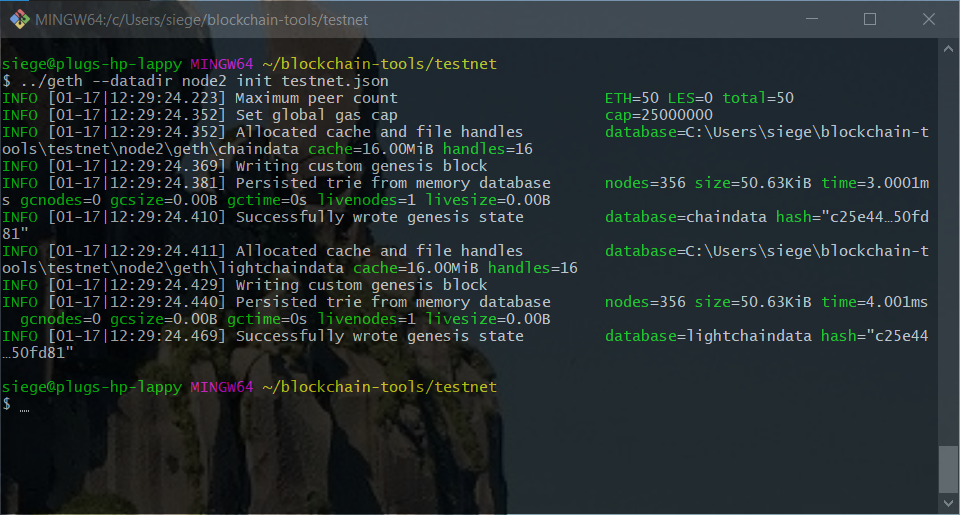

### Start mining

- Using the current `git bash` instance, run `geth` to spin up the first node, replacing the `0x...` with **your** first node's *public address*

  ``` bash
  ../geth --datadir node1 --unlock "0xB71A846632338E2ea2B5f10fA3B15bF74Fdd9Dc1" --mine --rpc --allow-insecure-unlock
  ```

- Several lines down, as the node boots, *in my bash instance* where it says:

  ``` bash
  INFO [01-17|12:36:32.858] Started P2P networking
  ```

  - There is a reference to the `enode`.

    - *Copy that line in **your** bash instance*

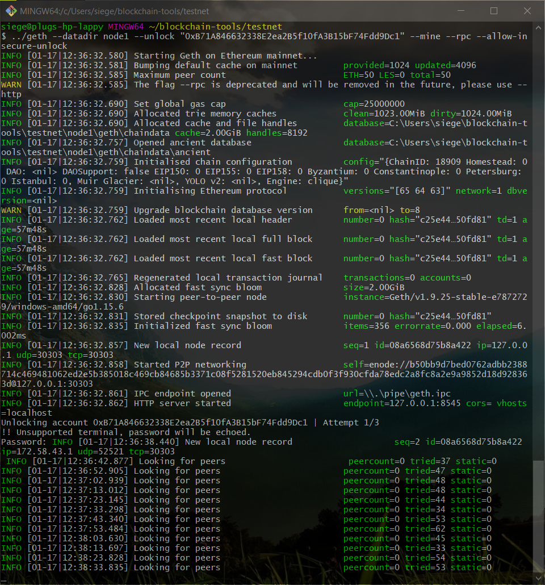

- Open a **second instance** of `git bash` and run the following, replacing the `0x` with the *public address* of your second node

  - Be sure to replace the `enode://` with the `enode` string you copied from the previous step

  ``` bash
  ../geth --datadir node2 --unlock "0x95DC648D0e13BA2f522101AF66F3ff147Fb88425" --mine --port 30304 --bootnodes "enode://b50bb9d7bed0762adbb2388714c469481062ed2e5b385018c469cb84685b3371c08f5281520eb845294cdb0f3f930cfda78edc2a8fc8a2e9a9852d18d928363d@127.0.0.1:30303" --ipcdisable --allow-insecure-unlock
  ```
  
- Voila! You've created your first blockchain!

### Transfer testnet coin

- Open `MyCrypto` and click on `Change Network`

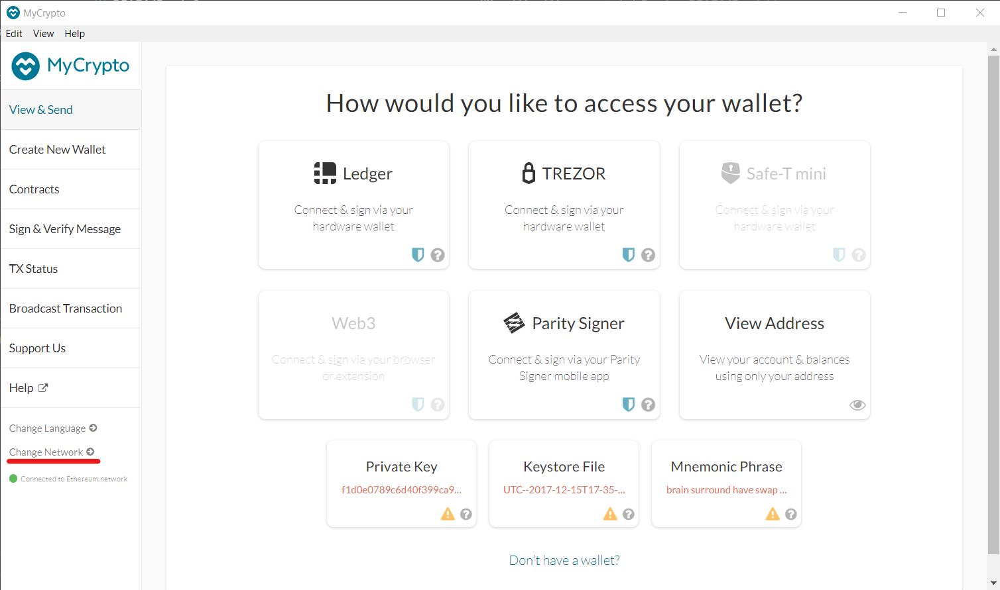

- Select `Add Custom Node`

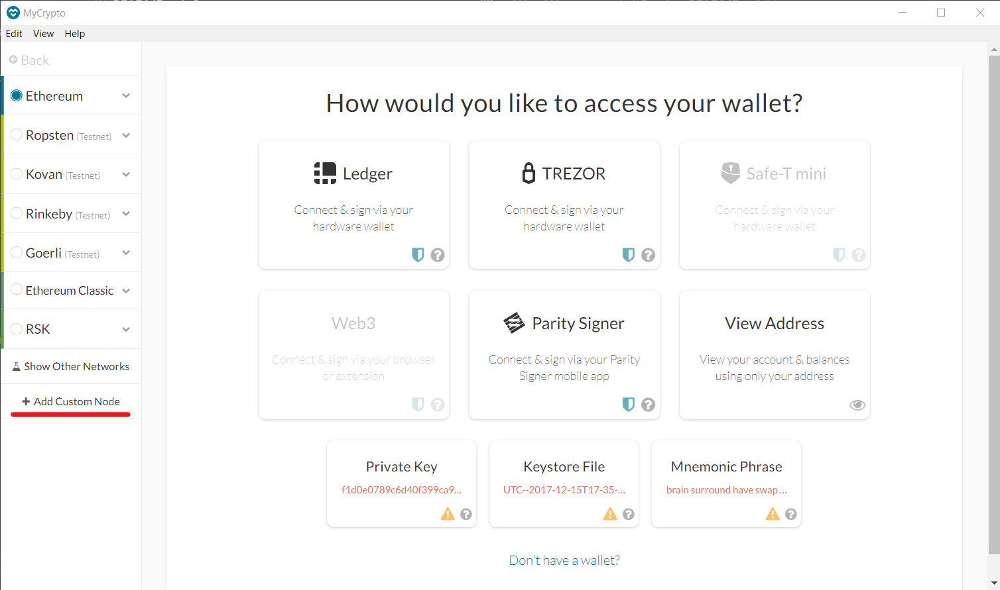

- Use the default settings to connect with your new test network

  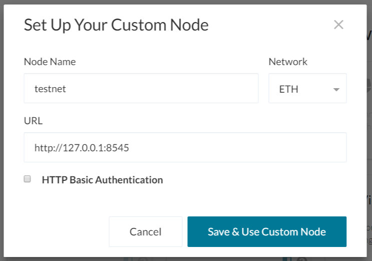

  - Back at the mainscreen, select `Keystore File`

    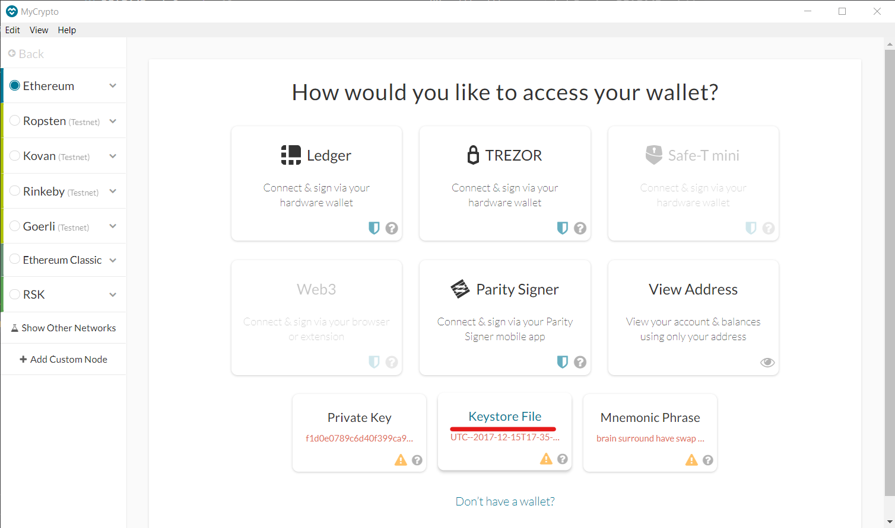

  - Open the keystore file in either `node1` or `node2` by navigating to the respective folder in your `testnet` directory

  - Once your wallet opens, you can send to any other address on your blockchain!

    - *Which in this case is the public address you created for `node2`*

    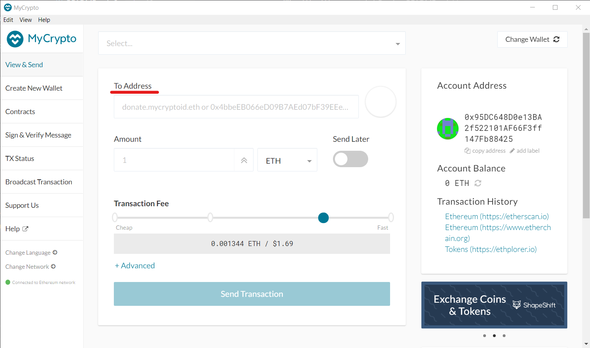

- Congratulations, you have now created your very first blockchain and transferred your very first cryptocurrency!
