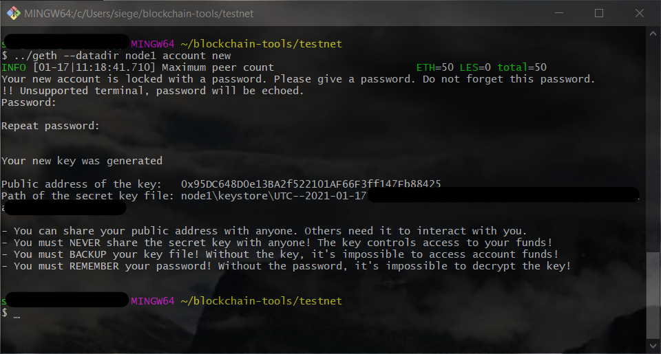
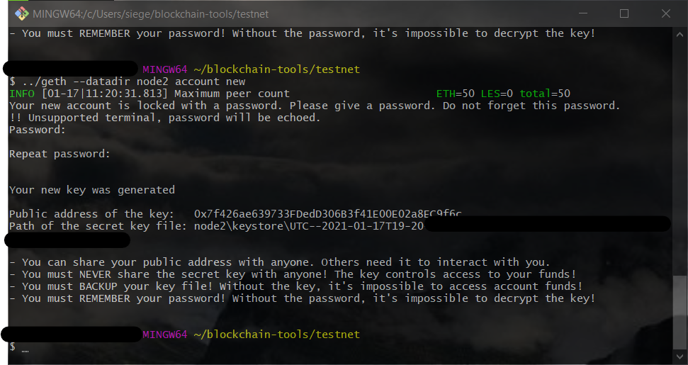

# Testnet

Create a cryptocurrency testnet with multiple nodes to transfer test funds between nodes using puppeth, geth and MyCrypto wallet

## Tools
- [git bash](https://git-scm.com/downloads)

- [geth](https://geth.ethereum.org/downloads/)
  - *download the latest version of `Geth & Tools` for your system*

- [puppeth](https://geth.ethereum.org/downloads/)
  - *included with `Geth & Tools`*

- [MyCrypto Wallet](https://download.mycrypto.com/)

### Setup

- Create a directory for your testnet

- Unpack the folder within `Geth & Tools`

  - Move folder to your testnet directory
  
  - Rename folder to something simpler, like **Blockchain-Tools**

- Install **MyCrypto Wallet**

  - Create a new wallet using a **Mnemonic Key**

    - *RECORD YOUR KEY IN A SAFE PLACE*

#### Create blockchain

- Open `git bash` and navigate to your testnet directory

- Create a folder with your directory *inside* the `Blockchain-Tools` folder

  - Name this folder `testnet`

- Navigate into `testnet` and run the following

```
../geth --datadir node1 account new
```

- Choose *(and write down or otherwise save)* a password and *save the public address that `geth` returns*



```
../geth --datadir node2 account new
```

- Choose another password and *be certain to save your node's password *save the public address `geth` returns



